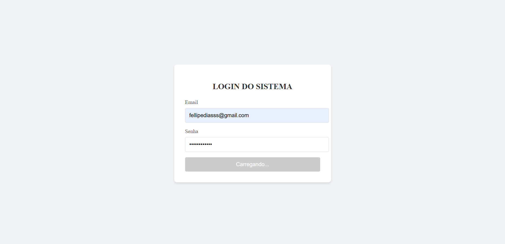

# 🔐 Formulário de Login React

 *(adicione depois)*

## 📚 Sobre  
Trabalho da disciplina **Programação Web Front-End** na [UniCarioca](https://www.unicarioca.edu.br).

## ✨ Funcionalidades  
- ✅ Campos de usuário/senha validados  
- ✅ Componentes reutilizáveis (`<TextBox>`, `<Button>`)  
- ✅ Estado gerenciado via Hooks  

## 🚀 Como Executar  
```bash
npm install
npm start